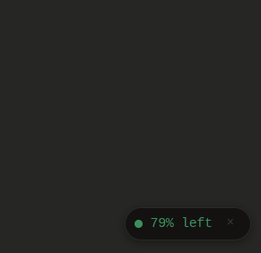
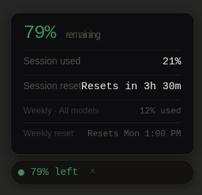
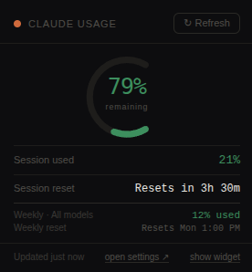

<h1 align="center">
  
  Claude Usage Monitor
</h1>

A minimal Chrome extension that tracks your Claude.ai usage limits at a glance — session, weekly, and reset times — without ever leaving the page.


---

## Screenshots

### Floating widget

<div align="center">
  
  &nbsp;&nbsp;&nbsp;
  
</div>

A draggable pill that lives on every claude.ai page. Click to expand session and weekly limits inline. Hide it with × and restore from the popup.

### Popup

<div align="center">
  
</div>

Click the toolbar icon for the full view — arc gauge, session used, reset countdown, and weekly limits.

## Features

- **Badge on the toolbar icon** — shows remaining % at a glance, color-coded green → amber → orange → red
- **Floating widget** on every claude.ai page — draggable pill with expandable detail card, no setup needed
- **Popup** with arc visualization, session + weekly limits, reset countdown
- **Auto-refresh** via direct API call to `claude.ai/api/organizations/{orgId}/usage` — no tab scraping, no DOM parsing
- **Auto-refresh on prompt completion** — detects when Claude finishes streaming and fetches updated data automatically
- **Persistent widget visibility** — hide/show preference saved across sessions

---

## How it works

Unlike extensions that scrape the settings page or estimate tokens locally, this extension calls the same internal API that the claude.ai settings page uses:

```
GET https://claude.ai/api/organizations/{orgId}/usage
```

Returns `five_hour.utilization`, `seven_day.utilization`, and `resets_at` timestamps directly — exact numbers, no estimation.

```json
{
  "five_hour":  { "utilization": 37.0, "resets_at": "2026-03-25T05:00:00Z" },
  "seven_day":  { "utilization": 12.0, "resets_at": "2026-03-31T14:00:00Z" },
  "extra_usage": { "is_enabled": true, "utilization": 9.0 }
}
```

The org ID is resolved automatically from `https://claude.ai/api/organizations` on first load.

---

## Installation

1. Clone or download this repo
```bash
git clone https://github.com/teolima99/claude-usage-monitor.git
```

2. Open Chrome and go to `chrome://extensions/`
3. Enable **Developer mode** (top right toggle)
4. Click **Load unpacked** and select the cloned folder
5. Make sure you're logged in to [claude.ai](https://claude.ai)
6. The extension fetches data automatically on install

The badge updates every 5 minutes automatically and immediately when a prompt finishes.

---

## Files

| File | Purpose |
|------|---------|
| `manifest.json` | Chrome MV3 config |
| `background.js` | Service worker — API polling, badge updates, storage |
| `widget.js` | Floating pill injected on all claude.ai pages |
| `popup.html/js` | Toolbar popup with arc visualization |
| `content.js` | Fallback DOM scraper for settings page |

---

## Privacy

- All data stored locally in `chrome.storage.local`
- No external servers, no analytics, no tracking
- Only communicates with `claude.ai` (which you're already logged into)
- Open source — read every line

See [PRIVACY.md](PRIVACY.md) for the full policy.

---

## License

MIT

---

Built by [Teodoro Lima](https://github.com/teolima99)
